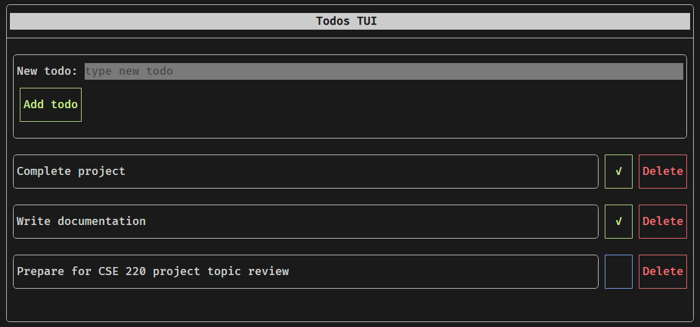

# Todos TUI

A terminal user interface for a todo list manager built with the [FTXUI library](https://github.com/ArthurSonzogni/FTXUI).



## Features

- Add new todos
- Mark todos as complete
- Delete todos
- Save todos to file on exit
- Read todos from file on start
- TUI can be interacted with keyboard and mouse

## Building and running

Clone this repository and navigate into it.

```bash
git clone https://github.com/srijan-nayak/todos_tui.git
cd todos_tui
```

Create the build folder and build the application.

```bash
mkdir build
cd build
cmake ..
make
```

**NOTE For building in an environment with older toolchain:** Run the following commands before running the above commands.

```bash
apt install gcc-9 g++-9
export CC=/usr/bin/gcc-9
export CXX=/usr/bin/g++-9
```

Run the application.

```bash
./todos_tui
```

## Usage notes

After running the application, you can navigate the user interface with keyboard arrow buttons or the mouse. To "click" a focused button with the keyboard hit `Enter`.

Hit `Ctl+C` to quit the application.

## File/Class structure of the project

```bash
src
├── main.cpp # Loads todos from file, starts TUI, writes todos to file
├── todos
│   ├── TodoItem.cpp # Implementation file for TodoItem.h
│   ├── TodoItem.h # TodoItem class that models a single todo item and its behaviours
│   ├── TodoList.cpp # Implementation file for TodoList.h
│   ├── TodoList.h # TodoList class that models a todo list, that contains multiple TodoItems, along with its behaviours
│   ├── TodoListFileManager.cpp # Implementation file for TodoListFileManager.h
│   └── TodoListFileManager.h # TodoListFileManager class that handles reading and writing todos to a file
└── tui
    ├── TodosTui.cpp # Implementation file for TodosTui.h
    └── TodosTui.h # TodosTui class that builds and runs the TUI loop with a reference to a TodoList instance
```

## Udacity C++ capstone project's addressed rubric points

### Loops, Functions, IO

| Criteria                                                                                       | Note/Location where addressed                                                                                |
| ---------------------------------------------------------------------------------------------- | ------------------------------------------------------------------------------------------------------------ |
| The project demonstrates an understanding of C++ functions and control structures.             | Addressed throught most implementation files                                                                 |
| The project reads data from a file and process the data, or the program writes data to a file. | `src/todos/TodoListFileManager.cpp`                                                                          |
| The project accepts user input and processes the input.                                        | `src/tui/TodosTui.cpp` (`TodosTui::NewTodoForm`, `TodosTui::TodoItemComponent`) (through fields and buttons) |

### Object Oriented Programming

| Criteria                                                       | Note/Location where addressed                                                                 |
| -------------------------------------------------------------- | --------------------------------------------------------------------------------------------- |
| The project uses Object Oriented Programming techniques.       | Described above in [File/Class structure of the project](#fileclass-structure-of-the-project) |
| Classes use appropriate access specifiers for class members.   | All classes have private and public members                                                   |
| Class constructors utilize member initialization lists.        | All classes with uninitialized instance members have member initialization lists              |
| Classes abstract implementation details from their interfaces. | All member function document their effect through descriptive function names                  |
| Classes encapsulate behavior.                                  | All classes contain appropriate data and function grouped together                            |

### Memory Management

| Criteria                                                      | Note/Location where addressed                                                                                                       |
| ------------------------------------------------------------- | ----------------------------------------------------------------------------------------------------------------------------------- |
| The project makes use of references in function declarations. | `src/todos/TodoListFileManager.cpp` (`TodoListFileManager::WriteTodoItems`), `src/tui/TodosTui.cpp` (`TodosTui::TodoItemComponent`) |
